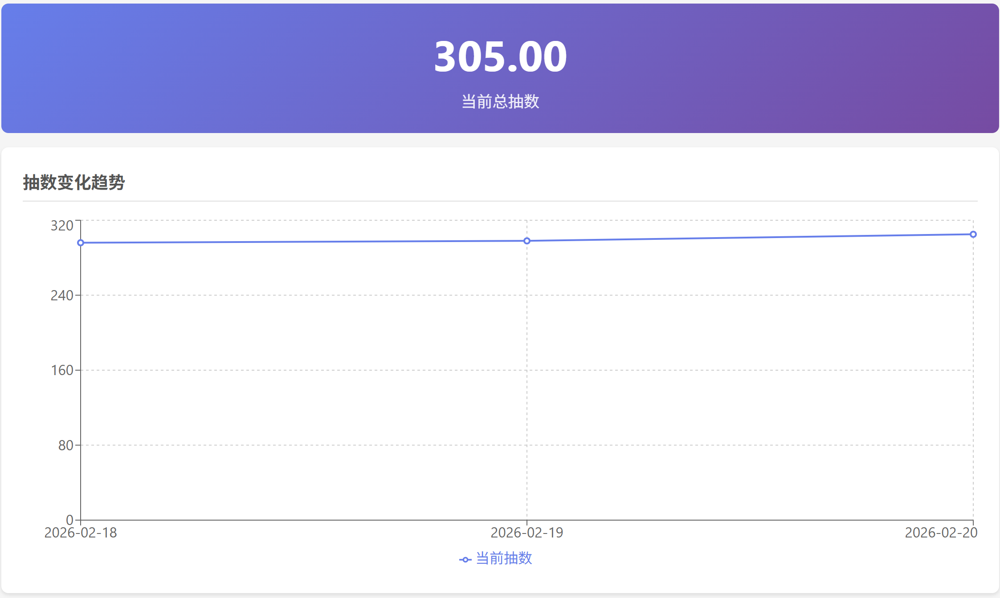

# 抽卡资源管理工具

记录不同游戏(抽卡类游戏)的各种资源数量(可转换为抽数的资源), 方便查看整体的抽数变化.

# 特性
- 支持各种资源, 包括不限于可直接兑换抽数和商店内可兑换抽卡资源的材料
- 可以维护游戏的版本日期, 快速查看某版本内的抽数变化
- 也支持记录和统计垫到卡池的抽数

# 部署

## docker compose

```
services:
  app:
    image: slk1133/gacha-tracker:latest
    container_name: gacha-tracker
    ports:
      - "7001:7001"
    volumes:
      # Persist database
      - ./data:/app/data
    environment:
      - TZ=Asia/Shanghai
      - NODE_ENV=production
    restart: unless-stopped
```


# 预览

